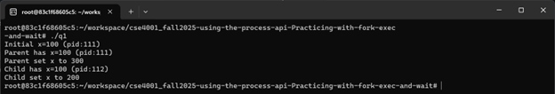
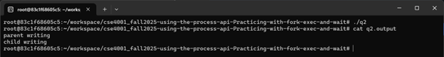
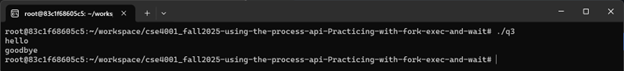
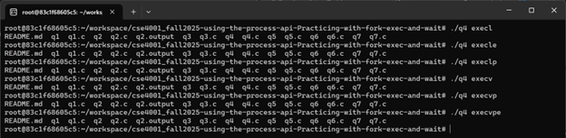
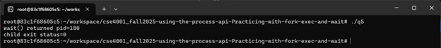
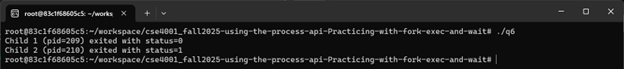
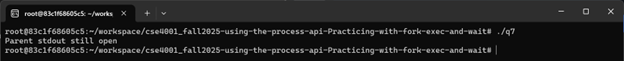

# Assignment: Practicing the Process API
Practicing with fork, exec, wait. 

### Overview

In this assignment, you will practice using the Process API to create processes and run programs under Linux. The goal is to gain hands-on experience with system calls related to process management. Specifically, you will practice using the unix process API functions 'fork()', 'exec()', 'wait()', and 'exit()'. 

⚠️ Note: This is not an OS/161 assignment. You will complete it directly on Linux. 

Use the Linux in your CSE4001 container. If you are using macOS, you may use the Terminal (you may need to install development tools with C/C++ compilers). 

**Reference Reading**: Arpaci-Dusseau, *Operating Systems: Three Easy Pieces*, Chapter 5 (Process API Basics)
 👉 [Chapter 5 PDF](http://pages.cs.wisc.edu/~remzi/OSTEP/cpu-api.pdf)

---

### **Steps to Complete the Assignment**

1. **Accept the GitHub Classroom Invitation**
    [GitHub Link](https://classroom.github.com/a/FZh4BrQG)
2. **Set up your Repository**
   - Clone the assignment repository.
3. **Study the Reference Materials**
   - Read **Chapter 5**.
   - Download and explore the sample programs from the textbook repository:
      [OSTEP CPU API Code](https://github.com/remzi-arpacidusseau/ostep-code/tree/master/cpu-api).
4. **Write Your Programs**
   - Adapt the provided example code to answer the assignment questions.
   - Each program should be clear, well-commented, and compile/run correctly.
   - Add your solution source code to the repository.

5. **Prepare Your Report**
   - Answer the questions in the README.md file. You must edit the README.md file and not create another file with the answers. 
   - For each question:
     - Include your **code**.
     - Provide your **answer/explanation**.
6. **Submit Your Work via GitHub**
   - Push both your **program code** to your assignment repository.
   - This push will serve as your submission.
   - Make sure all files, answers, and screenshots are uploaded and rendered properly.


---
### Questions
1. Write a program that calls `fork()`. Before calling `fork()`, have the main process access a variable (e.g., x) and set its value to something (e.g., 100). What value is the variable in the child process? What happens to the variable when both the child and parent change the value of x?


```cpp
#include <stdio.h>
#include <stdlib.h>
#include <unistd.h>

int main(void) {
    int x = 100;
    printf("Initial x=%d (pid:%d)\n", x, (int)getpid());
    int rc = fork();

    if (rc < 0) {
      // Fork failed: Return an error and exit
      perror("fork");
      exit(1);
    } else if (rc == 0) {
        // Child
        printf("Child has x=%d (pid:%d)\n", x, (int)getpid());
        x = 200;
        printf("Child set x to %d\n", x);
    } else {
        // Parent
        printf("Parent has x=%d (pid:%d)\n", x, (int)getpid());
        x = 300;
        printf("Parent set x to %d\n", x);
    }
    return 0;
}
```



*The child starts with the same value of x as the parent before fork is called. After the fork, the parent and child have separate addresses. Because they are modifying separate copies, when the child sets x=200, and the parent sets x=300, they don’t affect each other.*


2. Write a program that opens a file (with the `open()` system call) and then calls `fork()` to create a new process. Can both the child and parent access the file descriptor returned by `open()`? What happens when they are writing to the file concurrently, i.e., at the same time?

```cpp
#include <stdio.h>
#include <stdlib.h>
#include <unistd.h>
#include <fcntl.h>
#include <sys/wait.h>
#include <string.h>

int main(void) {
    int fd = open("q2.output", O_CREAT|O_WRONLY|O_TRUNC, 0700);
    if (fd < 0) { 
      perror("open"); 
      exit(1); 
    }

    // Create new process
    int rc = fork();
    if (rc < 0) { 
      perror("fork"); 
      exit(1); 
    }
    else if (rc == 0) {
        // Child process
        const char *msg = "child writing\n";
        if (write(fd, msg, strlen(msg)) < 0) perror("write(child)");
        _exit(0);
    } else {
        // Parent process
        const char *msg = "parent writing\n";
        if (write(fd, msg, strlen(msg)) < 0) 
          perror("write(parent)");
        wait(NULL);  // Parent waits for child to finish writing
    }
    return 0;
}
```


*Q2.output is opened before calling fork(), allowing the parent and child to inherit the same file descriptor. Since they share the same open file, the writes go to the same file. When they are writing concurrently the output can either appear in different orders, or get mixed together in the file.*


3. Write another program using `fork()`.The child process should print “hello”; the parent process should print “goodbye”. You should try to ensure that the child process always prints first; can you do this without calling `wait()` in the parent?

```cpp
#include <stdio.h>
#include <stdlib.h>
#include <unistd.h>

int main(void) {
    // Create pipe
    int p[2];
    if (pipe(p) < 0) { 
        perror("pipe"); 
        exit(1); 
    }
  
    // Fork for child process
    int rc = fork();
    if (rc < 0) { 
        perror("fork"); 
        exit(1); 
    }
    
    else if (rc == 0) {
        // Child process
        close(p[0]);  // Child doesn't need read end
        printf("hello\n");
      
        // Child signals parent and exits
        if (write(p[1], "x", 1) < 0) 
            perror("write");
        close(p[1]);
        _exit(0);
    } 
    
    else {
        // Parent process
        close(p[1]);  // Parent doesn't need write end
        
        // Parent blocks until child has printed
        char buf;      
        if (read(p[0], &buf, 1) < 0)
            perror("read");
        close(p[0]);
        printf("goodbye\n");  // Parent prints after child is done
    }
    return 0;
}
```


*The program forks a child process that prints “hello” and a pipe is used so that parent is blocked until the child writes a single byte. This guarantees that the child always prints first without using wait().*


4. Write a program that calls `fork()` and then calls some form of `exec()` to run the program `/bin/ls`. See if you can try all of the variants of `exec()`, including (on Linux) `execl()`, `execle()`, `execlp()`, `execv()`, `execvp()`, and `execvpe()`. Why do you think there are so many variants of the same basic call?

```cpp
#define _GNU_SOURCE
#include <stdio.h>
#include <stdlib.h>
#include <unistd.h>
#include <sys/wait.h>
#include <string.h>

extern char **environ;

int main(int argc, char *argv[]) {
      if (argc != 2) {
      fprintf(stderr, "Variant needed: execl, execle, execlp, execv, execvp, execvpe\n");
      exit(1);
    }

    int rc = fork();
    if (rc < 0) { 
        perror("fork"); 
        exit(1); 
    }
    else if (rc == 0) {
        // Child process
        // Run bin/ls exec() varaint based on command-line arg
        if (strcmp(argv[1], "execl") == 0) {
            execl("/bin/ls", "ls", NULL);
        } else if (strcmp(argv[1], "execle") == 0) {
            execle("/bin/ls", "ls", NULL, environ);
        } else if (strcmp(argv[1], "execlp") == 0) {
            execlp("ls", "ls", NULL);
        } else if (strcmp(argv[1], "execv") == 0) {
            char *av[] = { "ls", NULL };
            execv("/bin/ls", av);
        } else if (strcmp(argv[1], "execvp") == 0) {
            char *av[] = { "ls", NULL };
            execvp("ls", av);
        } else if (strcmp(argv[1], "execvpe") == 0) {
            char *av[] = { "ls", NULL };
            execvpe("ls", av, environ);
        } else {
            fprintf(stderr, "Unknown option: %s\n", argv[1]);
            exit(1);
        }
        
        // If exec() fails:
        perror("exec* failed");
        _exit(127);
    } else {
        // Parent process
        int status;
        waitpid(rc, &status, 0);  // Wait for child to finish
    }
    return 0;
}
```


*The program forks a child and replaces the child with /bin/ls using one of the exec*() variants. There are many different variants because each handles different programming needs when running a program process: 
l – arguments are passed as a fixed list
v – arguments are passed as an array
p – searching the system for the program in PATH 
e – explicit environment array, instead of inheriting parent’s environment*


5. Now write a program that uses `wait()` to wait for the child process to finish in the parent. What does `wait()` return? What happens if you use `wait()` in the child?

```cpp
#include <stdio.h>
#include <stdlib.h>
#include <unistd.h>
#include <sys/wait.h>

int main(void) {
    // Create new process
    int rc = fork();
    if (rc < 0) { 
      perror("fork"); 
      exit(1); 
    }
    else if (rc == 0) {
        // Child process
        _exit(0);
    } 
    else {
        // Parent process
        int status = 0;
        pid_t pid = wait(&status);
        printf("wait() returned pid=%d\n", (int)pid);
        
        // Check exit status of child
        if (WIFEXITED(status))
            printf("child exit status=%d\n", WEXITSTATUS(status));
    }
    return 0;
}
```


*The program forks a child process and the parent calls wait(), which pauses its execution until the child finishes. If wait() is used in the child, it fails immediately because it has no children of its own.*


6. Write a slight modification of the previous program, this time using `waitpid()` instead of `wait()`. When would `waitpid()` be useful?

```cpp
#include <stdio.h>
#include <stdlib.h>
#include <unistd.h>
#include <sys/wait.h>

int main(void) {
    // 1st child
    pid_t c1 = fork();
    if (c1 < 0) { 
        perror("fork1"); 
        exit(1); 
    }
    if (c1 == 0)
        _exit(0);

    // 2nd child 
    pid_t c2 = fork();
    if (c2 < 0) { 
        perror("fork2"); 
        exit(1); 
    }
    if (c2 == 0)
        _exit(1);

    // Parent process
    int st1=0, st2=0;
    pid_t r1 = waitpid(c2, &st2, 0);  // Wait for c2
    pid_t r2 = waitpid(c1, &st1, 0);  // Wait for c1

    // Print results 
    if (WIFEXITED(st1)) {
        printf("Child 1 (pid=%d) exited with status=%d\n", (int)r2, WEXITSTATUS(st1));
    }
    if (WIFEXITED(st2)) {
        printf("Child 2 (pid=%d) exited with status=%d\n", (int)r1, WEXITSTATUS(st2));
    }
        
  return 0;
}
```


*The program forks two children and the parent waits for the child based on its PID. Waitpid() allows the parent to control the order it pauses execution for and collect information, which is useful when managing multiple children that need to be tracked.*


7. Write a program that creates a child process, and then in the child closes standard output (`STDOUT FILENO`). What happens if the child calls `printf()` to print some output after closing the descriptor?

```cpp
#include <stdio.h>
#include <stdlib.h>
#include <unistd.h>
#include <errno.h>
#include <sys/wait.h>

int main(void) {
    int rc = fork();
    if (rc < 0) { 
        perror("fork"); 
        exit(1); 
    }
    else if (rc == 0) {
        // Child process
        if (close(STDOUT_FILENO) < 0) 
            perror("close");  // Close standard output file
        
        printf("Child stdout closed\n");  // Test - Should NOT appear on terminal
    } 
    else {
        // Parent process
        printf("Parent stdout still open\n");  // stdout still open for parent
        wait(NULL);
    }
    return 0;
}
```


*The program forks the child and closes its standard output file descriptor. Afterwards, any attempt to print in the child produces no visible output because stdout is no longer valid. The parent, which still has its own open stdout, can continue to print. *

